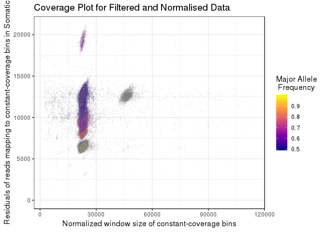
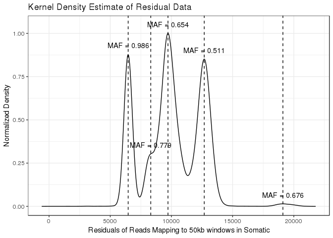
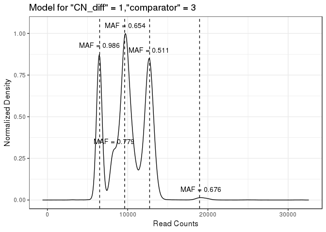
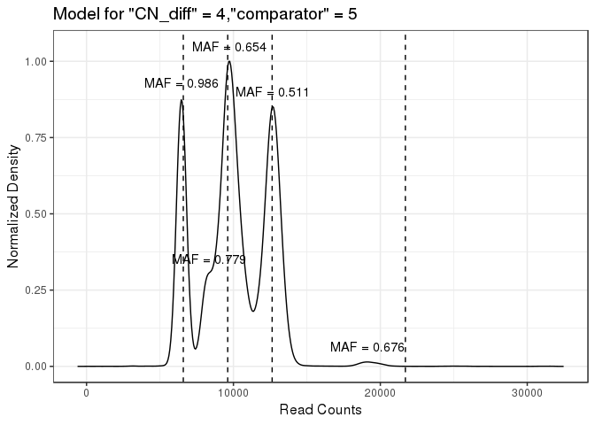
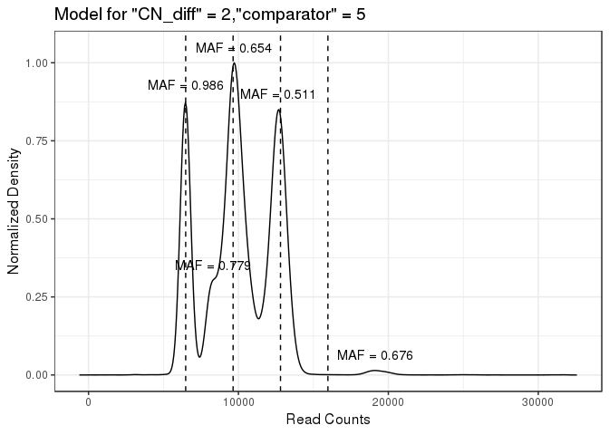
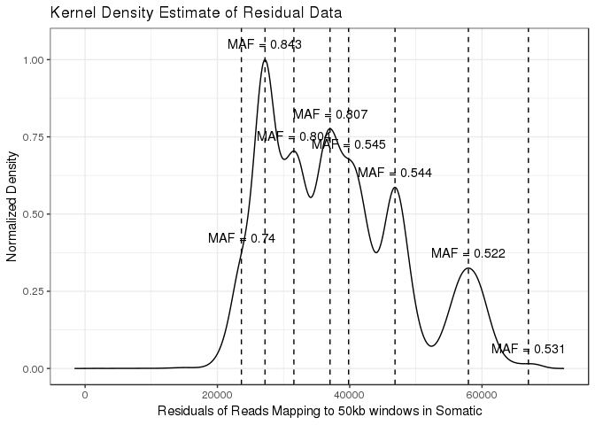
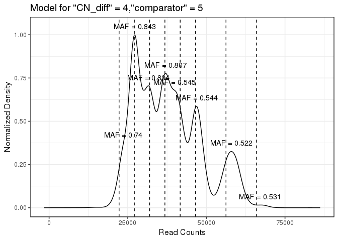
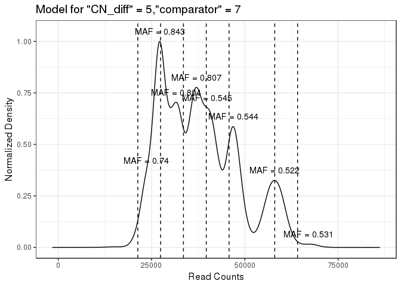

## Data import

First we import the data, formatted as discussed on the README.md. This data is from COLO829, a triploid cell line


```r
dat <- read.table("exampledata.txt", stringsAsFactors = F, header = T)
str(dat)
```

```
## 'data.frame':	122330 obs. of  6 variables:
##  $ tumour: int  13445 14060 12069 3252 9144 9105 10004 8497 8384 8364 ...
##  $ normal: int  1000001 1000025 1000009 1000011 1000001 1000067 1000030 1000021 1000059 1000020 ...
##  $ maf   : chr  "." "." "." "." ...
##  $ window: chr  "1_0" "1_134276" "1_238529" "1_536232" ...
##  $ size  : int  134276 104253 297703 65788 90610 32473 19010 24286 22209 22522 ...
##  $ gc    : num  0.385 0.238 0.282 0.438 0.419 ...
```

## Running Ploidetect

Now we run Ploidetect by calling ```ploidetect()```, and supplying the indices for the columns in our data, and a "bw" argument which will be explained


```
## [1] 116
## [1] 19
## [1] 98
## [1] 8
## [1] 3
```

<!-- --><!-- -->

```
## [1] "Generating list of peak models"
## [1] "Generating model for CN difference between fitted peaks = 1 with secondary peak as #2 in terms of intensity"
## [1] "matched positive peak indices in allPeaks is 4"
## [1] "matched positive peak indices in allPeaks is 5"
## [1] "Generating model for CN difference between fitted peaks = 2 with secondary peak as #2 in terms of intensity"
## [1] "matched positive peak indices in allPeaks is 4"
## [1] "matched positive peak indices in allPeaks is 5"
## [1] "Generating model for CN difference between fitted peaks = 3 with secondary peak as #2 in terms of intensity"
## [1] "matched positive peak indices in allPeaks is 4"
## [1] "matched positive peak indices in allPeaks is 5"
## [1] "Generating model for CN difference between fitted peaks = 4 with secondary peak as #2 in terms of intensity"
## [1] "matched positive peak indices in allPeaks is 4"
## [1] "matched positive peak indices in allPeaks is 5"
## [1] "Generating model for CN difference between fitted peaks = 5 with secondary peak as #2 in terms of intensity"
## [1] "matched positive peak indices in allPeaks is 4"
## [1] "matched positive peak indices in allPeaks is 5"
## [1] "Generating model for CN difference between fitted peaks = 1 with secondary peak as #3 in terms of intensity"
## [1] "matched positive peak indices in allPeaks is 4"
## [1] "matched positive peak indices in allPeaks is 5"
## [1] "Generating model for CN difference between fitted peaks = 2 with secondary peak as #3 in terms of intensity"
## [1] "matched positive peak indices in allPeaks is 4"
## [1] "matched positive peak indices in allPeaks is 5"
## [1] "Generating model for CN difference between fitted peaks = 3 with secondary peak as #3 in terms of intensity"
## [1] "matched positive peak indices in allPeaks is 4"
## [1] "matched positive peak indices in allPeaks is 5"
## [1] "Generating model for CN difference between fitted peaks = 4 with secondary peak as #3 in terms of intensity"
## [1] "matched positive peak indices in allPeaks is 4"
## [1] "matched positive peak indices in allPeaks is 5"
## [1] "Generating model for CN difference between fitted peaks = 5 with secondary peak as #3 in terms of intensity"
## [1] "matched positive peak indices in allPeaks is 4"
## [1] "matched positive peak indices in allPeaks is 5"
## [1] "Generating model for CN difference between fitted peaks = 1 with secondary peak as #4 in terms of intensity"
## [1] "matched positive peak indices in allPeaks is 4"
## [1] "matched positive peak indices in allPeaks is 5"
## [1] "Generating model for CN difference between fitted peaks = 2 with secondary peak as #4 in terms of intensity"
## [1] "matched positive peak indices in allPeaks is 4"
## [1] "matched positive peak indices in allPeaks is 5"
## [1] "Generating model for CN difference between fitted peaks = 3 with secondary peak as #4 in terms of intensity"
## [1] "matched positive peak indices in allPeaks is 4"
## [1] "matched positive peak indices in allPeaks is 5"
## [1] "Generating model for CN difference between fitted peaks = 4 with secondary peak as #4 in terms of intensity"
## [1] "matched positive peak indices in allPeaks is 4"
## [1] "matched positive peak indices in allPeaks is 5"
## [1] "Generating model for CN difference between fitted peaks = 5 with secondary peak as #4 in terms of intensity"
## [1] "matched positive peak indices in allPeaks is 4"
## [1] "matched positive peak indices in allPeaks is 5"
## [1] "Generating model for CN difference between fitted peaks = 1 with secondary peak as #5 in terms of intensity"
## [1] "matched positive peak indices in allPeaks is 5"
## [1] "Generating model for CN difference between fitted peaks = 2 with secondary peak as #5 in terms of intensity"
## [1] "matched positive peak indices in allPeaks is 4"
## [1] "matched positive peak indices in allPeaks is 5"
## [1] "Generating model for CN difference between fitted peaks = 3 with secondary peak as #5 in terms of intensity"
## [1] "matched positive peak indices in allPeaks is 4"
## [1] "matched positive peak indices in allPeaks is 5"
## [1] "Generating model for CN difference between fitted peaks = 4 with secondary peak as #5 in terms of intensity"
## [1] "matched positive peak indices in allPeaks is 4"
## [1] "matched positive peak indices in allPeaks is 5"
## [1] "Generating model for CN difference between fitted peaks = 5 with secondary peak as #5 in terms of intensity"
## [1] "matched positive peak indices in allPeaks is 4"
## [1] "matched positive peak indices in allPeaks is 5"
```

<!-- --><!-- --><!-- --><!-- --><!-- -->

## Interpreting the results

For interpreting the results, it is probably valuable to explain what all these plots mean. 

Ploidetect will first give you one scatter plot. Each point in this scatter plot represents a single region of the genome. The X-axis of the scatterplot corresponds to the size of the genomic regions, as the data was generated using variable-size bins to correct for mappability biases. Therefore the value on the X axis is inversely proportional to the mappability of the region (since as mappability decreases, the size of the bin increases). The Y-axis of the scatterplot is the corrected depth of coverage of the tumour genome. 

The density plots are a visual representation of Ploidetect's attempts at determining the tumour purity. They can be thought of as a smoothed histogram of the read depth. Generally we observe that the density plots show a few peaks, where each peak represents a cluster of genomic regions with a similar coverage. We assume that a bunch of regions with similar coverage means that those regions have the same copy number. Ploidetect tries to select a set of peaks that are regularly spaced, since the read depth difference between a 1-copy region and a 2-copy region should be the same as the difference between a 2-copy region and a 3-copy region. The first density plot shows where peaks have been called in the data. Each subsequent density plot is the result of Ploidetect selecting a set from those peaks to estimate the difference in coverage between integer copy numbers in the tumour genome.

Let's look at the purity results for this case:

```r
(tc <- result$TC_calls)
```

```
##   mappability.corrected_reads_per_copy     HOMD Ploidy        tc
## 1                             3113.351 286.3141      3 0.9560397
## 2                             3113.351 286.3141      3 0.9560397
## 3                             3113.351 286.3141      3 0.9560397
## 4                             3162.324 155.7296      3 0.9759691
## 5                             3023.210 541.3448      3 0.9178257
##   bottomsize lowest_peak_CN     mafdev CN_diff Comparator    newerr
## 1          0              2 0.03579857       1          2  6.217418
## 2          0              2 0.03579857       1          3  6.217418
## 3          0              2 0.03579857       3          5  6.217418
## 4          0              2 0.03573888       2          5 10.600590
## 5          0              2 0.03721800       4          5 29.032450
##   avg_ploidy unmatchedpct
## 1       3.01    0.0427163
## 2       3.01    0.0427163
## 3       3.01    0.0427163
## 4       3.00    0.0427163
## 5       3.01    0.0427163
```

These are the models that Ploidetect used to predict tumour purity in the sample. Given that this was a 100% pure sample, it did pretty well with 95.5%. But how do we make sure the results are fine? After all, a patient's health or an analysis could depend on it being correct.

The first step is to take a look at the CN_diff and Comparator columns. These are used to identify the model that was chosen and match it up to the plots above (the density plots with titles "Model for CN_diff = # and Comparator = #"). 

With the first row (best model) as an example, we see that Ploidetect chose 1 and 2, respectively. This means that it's using the #2 peak (measured by height) and assuming there is a copy number 1 difference between this and the highest peak. The corresponding plot indicates which peaks correspond to integer copy number states.

For this plot, we observe that four peaks have been fitted (four vertical dashed lines), and one peak has not (at roughly 7500 depth). What this means is that Ploidetect decided that this peak is likely a technical artifact or a subclonal copy number change, which has been skipped in the model. This is exactly what we're looking for. In fact, there is no model which actually uses that peak, which is unfortunate, because that would have been a good example of a bad model (and now I have to find another example). 

When you manually review Ploidetect's models, what you are looking for is fitting distinct, regularly spaced peaks. Here's an example where Ploidetect fails to get it right automatically. 


```r
dat <- read.table("../../coverage/POG496/binned/1/P01263_P01278_processed.bed", stringsAsFactors = F, header = T)
str(dat)
```

```
## 'data.frame':	52341 obs. of  6 variables:
##  $ V4    : int  37297 39212 45577 46388 50792 51422 47290 49854 52306 48457 ...
##  $ V5    : int  2500034 2500007 2500033 2500001 2500021 2500000 2500001 2500016 2500000 2500049 ...
##  $ window: chr  "1_0" "1_158239" "1_672080" "1_767057" ...
##  $ V6    : chr  "." "." "." "." ...
##  $ size  : int  158239 513841 94977 60633 94220 99312 87560 92938 102130 80879 ...
##  $ V7    : num  0.4 0.301 0.434 0.456 0.617 ...
```

```r
result_2 <- ploidetect(dat, normal = 2, tumour = 1, avg_allele_freq = 4, window_id = 3, window_size = 5, GC = 6, verbose = F, bw = 400)
```

```
## [1] 2
## [1] 37
## [1] 2
## [1] 29
## [1] 43
## [1] 2
## [1] 45
## [1] 14
```

<!-- --><!-- -->

```
## [1] "Generating list of peak models"
## [1] "Generating model for CN difference between fitted peaks = 1 with secondary peak as #2 in terms of intensity"
## [1] "matched positive peak indices in allPeaks is 4"
## [1] "matched positive peak indices in allPeaks is 6"
## [1] "matched positive peak indices in allPeaks is 7"
## [1] "matched positive peak indices in allPeaks is 8"
## [1] "Generating model for CN difference between fitted peaks = 2 with secondary peak as #2 in terms of intensity"
## [1] "matched positive peak indices in allPeaks is 3"
## [1] "matched positive peak indices in allPeaks is 4"
## [1] "matched positive peak indices in allPeaks is 5"
## [1] "matched positive peak indices in allPeaks is 6"
## [1] "matched positive peak indices in allPeaks is 7"
## [1] "matched positive peak indices in allPeaks is 8"
## [1] "Generating model for CN difference between fitted peaks = 3 with secondary peak as #2 in terms of intensity"
## [1] "matched positive peak indices in allPeaks is 3"
## [1] "matched positive peak indices in allPeaks is 4"
## [1] "matched positive peak indices in allPeaks is 5"
## [1] "matched positive peak indices in allPeaks is 6"
## [1] "matched positive peak indices in allPeaks is 7"
## [1] "matched positive peak indices in allPeaks is 8"
## [1] "Generating model for CN difference between fitted peaks = 4 with secondary peak as #2 in terms of intensity"
## [1] "matched positive peak indices in allPeaks is 3"
## [1] "matched positive peak indices in allPeaks is 4"
## [1] "matched positive peak indices in allPeaks is 5"
## [1] "matched positive peak indices in allPeaks is 6"
## [1] "matched positive peak indices in allPeaks is 7"
## [1] "matched positive peak indices in allPeaks is 8"
## [1] "Generating model for CN difference between fitted peaks = 5 with secondary peak as #2 in terms of intensity"
## [1] "matched positive peak indices in allPeaks is 3"
## [1] "matched positive peak indices in allPeaks is 4"
## [1] "matched positive peak indices in allPeaks is 5"
## [1] "matched positive peak indices in allPeaks is 6"
## [1] "matched positive peak indices in allPeaks is 7"
## [1] "matched positive peak indices in allPeaks is 8"
## [1] "Generating model for CN difference between fitted peaks = 1 with secondary peak as #3 in terms of intensity"
## [1] "matched positive peak indices in allPeaks is 3"
## [1] "matched positive peak indices in allPeaks is 4"
## [1] "matched positive peak indices in allPeaks is 5"
## [1] "matched positive peak indices in allPeaks is 6"
## [1] "matched positive peak indices in allPeaks is 7"
## [1] "matched positive peak indices in allPeaks is 8"
## [1] "Generating model for CN difference between fitted peaks = 2 with secondary peak as #3 in terms of intensity"
## [1] "matched positive peak indices in allPeaks is 3"
## [1] "matched positive peak indices in allPeaks is 4"
## [1] "matched positive peak indices in allPeaks is 5"
## [1] "matched positive peak indices in allPeaks is 6"
## [1] "matched positive peak indices in allPeaks is 7"
## [1] "matched positive peak indices in allPeaks is 8"
## [1] "Generating model for CN difference between fitted peaks = 3 with secondary peak as #3 in terms of intensity"
## [1] "matched positive peak indices in allPeaks is 3"
## [1] "matched positive peak indices in allPeaks is 4"
## [1] "matched positive peak indices in allPeaks is 5"
## [1] "matched positive peak indices in allPeaks is 6"
## [1] "matched positive peak indices in allPeaks is 7"
## [1] "matched positive peak indices in allPeaks is 8"
## [1] "Generating model for CN difference between fitted peaks = 4 with secondary peak as #3 in terms of intensity"
## [1] "matched positive peak indices in allPeaks is 3"
## [1] "matched positive peak indices in allPeaks is 4"
## [1] "matched positive peak indices in allPeaks is 5"
## [1] "matched positive peak indices in allPeaks is 6"
## [1] "matched positive peak indices in allPeaks is 7"
## [1] "matched positive peak indices in allPeaks is 8"
## [1] "Generating model for CN difference between fitted peaks = 5 with secondary peak as #3 in terms of intensity"
## [1] "matched positive peak indices in allPeaks is 3"
## [1] "matched positive peak indices in allPeaks is 4"
## [1] "matched positive peak indices in allPeaks is 5"
## [1] "matched positive peak indices in allPeaks is 6"
## [1] "matched positive peak indices in allPeaks is 7"
## [1] "matched positive peak indices in allPeaks is 8"
## [1] "Generating model for CN difference between fitted peaks = 1 with secondary peak as #4 in terms of intensity"
## [1] "matched positive peak indices in allPeaks is 5"
## [1] "matched positive peak indices in allPeaks is 7"
## [1] "matched positive peak indices in allPeaks is 8"
## [1] "Generating model for CN difference between fitted peaks = 2 with secondary peak as #4 in terms of intensity"
## [1] "matched positive peak indices in allPeaks is 3"
## [1] "matched positive peak indices in allPeaks is 5"
## [1] "matched positive peak indices in allPeaks is 6"
## [1] "matched positive peak indices in allPeaks is 7"
## [1] "matched positive peak indices in allPeaks is 8"
## [1] "Generating model for CN difference between fitted peaks = 3 with secondary peak as #4 in terms of intensity"
## [1] "matched positive peak indices in allPeaks is 3"
## [1] "matched positive peak indices in allPeaks is 4"
## [1] "matched positive peak indices in allPeaks is 5"
## [1] "matched positive peak indices in allPeaks is 6"
## [1] "matched positive peak indices in allPeaks is 7"
## [1] "matched positive peak indices in allPeaks is 8"
## [1] "Generating model for CN difference between fitted peaks = 4 with secondary peak as #4 in terms of intensity"
## [1] "matched positive peak indices in allPeaks is 3"
## [1] "matched positive peak indices in allPeaks is 4"
## [1] "matched positive peak indices in allPeaks is 5"
## [1] "matched positive peak indices in allPeaks is 6"
## [1] "matched positive peak indices in allPeaks is 7"
## [1] "matched positive peak indices in allPeaks is 8"
## [1] "Generating model for CN difference between fitted peaks = 5 with secondary peak as #4 in terms of intensity"
## [1] "matched positive peak indices in allPeaks is 3"
## [1] "matched positive peak indices in allPeaks is 4"
## [1] "matched positive peak indices in allPeaks is 5"
## [1] "matched positive peak indices in allPeaks is 6"
## [1] "matched positive peak indices in allPeaks is 7"
## [1] "matched positive peak indices in allPeaks is 8"
## [1] "Generating model for CN difference between fitted peaks = 1 with secondary peak as #5 in terms of intensity"
## [1] "matched positive peak indices in allPeaks is 6"
## [1] "matched positive peak indices in allPeaks is 8"
## [1] "Generating model for CN difference between fitted peaks = 2 with secondary peak as #5 in terms of intensity"
## [1] "matched positive peak indices in allPeaks is 4"
## [1] "matched positive peak indices in allPeaks is 6"
## [1] "matched positive peak indices in allPeaks is 7"
## [1] "matched positive peak indices in allPeaks is 8"
## [1] "Generating model for CN difference between fitted peaks = 3 with secondary peak as #5 in terms of intensity"
## [1] "matched positive peak indices in allPeaks is 3"
## [1] "matched positive peak indices in allPeaks is 5"
## [1] "matched positive peak indices in allPeaks is 6"
## [1] "matched positive peak indices in allPeaks is 7"
## [1] "matched positive peak indices in allPeaks is 8"
## [1] "Generating model for CN difference between fitted peaks = 4 with secondary peak as #5 in terms of intensity"
## [1] "matched positive peak indices in allPeaks is 3"
## [1] "matched positive peak indices in allPeaks is 4"
## [1] "matched positive peak indices in allPeaks is 5"
## [1] "matched positive peak indices in allPeaks is 6"
## [1] "matched positive peak indices in allPeaks is 7"
## [1] "matched positive peak indices in allPeaks is 8"
## [1] "Generating model for CN difference between fitted peaks = 5 with secondary peak as #5 in terms of intensity"
## [1] "matched positive peak indices in allPeaks is 3"
## [1] "matched positive peak indices in allPeaks is 5"
## [1] "matched positive peak indices in allPeaks is 6"
## [1] "matched positive peak indices in allPeaks is 7"
## [1] "matched positive peak indices in allPeaks is 8"
## [1] "Generating model for CN difference between fitted peaks = 1 with secondary peak as #6 in terms of intensity"
## [1] "matched positive peak indices in allPeaks is 3"
## [1] "matched positive peak indices in allPeaks is 4"
## [1] "matched positive peak indices in allPeaks is 5"
## [1] "matched positive peak indices in allPeaks is 6"
## [1] "matched positive peak indices in allPeaks is 7"
## [1] "matched positive peak indices in allPeaks is 8"
## [1] "Generating model for CN difference between fitted peaks = 2 with secondary peak as #6 in terms of intensity"
## [1] "matched positive peak indices in allPeaks is 3"
## [1] "matched positive peak indices in allPeaks is 4"
## [1] "matched positive peak indices in allPeaks is 5"
## [1] "matched positive peak indices in allPeaks is 6"
## [1] "matched positive peak indices in allPeaks is 7"
## [1] "matched positive peak indices in allPeaks is 8"
## [1] "Generating model for CN difference between fitted peaks = 3 with secondary peak as #6 in terms of intensity"
## [1] "matched positive peak indices in allPeaks is 3"
## [1] "matched positive peak indices in allPeaks is 4"
## [1] "matched positive peak indices in allPeaks is 5"
## [1] "matched positive peak indices in allPeaks is 6"
## [1] "matched positive peak indices in allPeaks is 7"
## [1] "matched positive peak indices in allPeaks is 8"
## [1] "Generating model for CN difference between fitted peaks = 4 with secondary peak as #6 in terms of intensity"
## [1] "matched positive peak indices in allPeaks is 3"
## [1] "matched positive peak indices in allPeaks is 4"
## [1] "matched positive peak indices in allPeaks is 5"
## [1] "matched positive peak indices in allPeaks is 6"
## [1] "matched positive peak indices in allPeaks is 7"
## [1] "matched positive peak indices in allPeaks is 8"
## [1] "Generating model for CN difference between fitted peaks = 5 with secondary peak as #6 in terms of intensity"
## [1] "matched positive peak indices in allPeaks is 3"
## [1] "matched positive peak indices in allPeaks is 4"
## [1] "matched positive peak indices in allPeaks is 5"
## [1] "matched positive peak indices in allPeaks is 6"
## [1] "matched positive peak indices in allPeaks is 7"
## [1] "matched positive peak indices in allPeaks is 8"
## [1] "Generating model for CN difference between fitted peaks = 1 with secondary peak as #7 in terms of intensity"
## [1] "matched positive peak indices in allPeaks is 7"
## [1] "Generating model for CN difference between fitted peaks = 2 with secondary peak as #7 in terms of intensity"
## [1] "matched positive peak indices in allPeaks is 5"
## [1] "matched positive peak indices in allPeaks is 7"
## [1] "matched positive peak indices in allPeaks is 8"
## [1] "Generating model for CN difference between fitted peaks = 3 with secondary peak as #7 in terms of intensity"
## [1] "matched positive peak indices in allPeaks is 4"
## [1] "matched positive peak indices in allPeaks is 6"
## [1] "matched positive peak indices in allPeaks is 7"
## [1] "matched positive peak indices in allPeaks is 8"
## [1] "Generating model for CN difference between fitted peaks = 4 with secondary peak as #7 in terms of intensity"
## [1] "matched positive peak indices in allPeaks is 4"
## [1] "matched positive peak indices in allPeaks is 5"
## [1] "matched positive peak indices in allPeaks is 6"
## [1] "matched positive peak indices in allPeaks is 7"
## [1] "matched positive peak indices in allPeaks is 8"
## [1] "Generating model for CN difference between fitted peaks = 5 with secondary peak as #7 in terms of intensity"
## [1] "matched positive peak indices in allPeaks is 3"
## [1] "matched positive peak indices in allPeaks is 5"
## [1] "matched positive peak indices in allPeaks is 6"
## [1] "matched positive peak indices in allPeaks is 7"
## [1] "matched positive peak indices in allPeaks is 8"
## [1] "Generating model for CN difference between fitted peaks = 1 with secondary peak as #8 in terms of intensity"
## [1] "matched positive peak indices in allPeaks is 8"
## [1] "Generating model for CN difference between fitted peaks = 2 with secondary peak as #8 in terms of intensity"
## [1] "matched positive peak indices in allPeaks is 6"
## [1] "matched positive peak indices in allPeaks is 8"
## [1] "Generating model for CN difference between fitted peaks = 3 with secondary peak as #8 in terms of intensity"
## [1] "matched positive peak indices in allPeaks is 5"
## [1] "matched positive peak indices in allPeaks is 7"
## [1] "matched positive peak indices in allPeaks is 8"
## [1] "Generating model for CN difference between fitted peaks = 4 with secondary peak as #8 in terms of intensity"
## [1] "matched positive peak indices in allPeaks is 4"
## [1] "matched positive peak indices in allPeaks is 6"
## [1] "matched positive peak indices in allPeaks is 7"
## [1] "matched positive peak indices in allPeaks is 8"
## [1] "Generating model for CN difference between fitted peaks = 5 with secondary peak as #8 in terms of intensity"
## [1] "matched positive peak indices in allPeaks is 4"
## [1] "matched positive peak indices in allPeaks is 5"
## [1] "matched positive peak indices in allPeaks is 7"
## [1] "matched positive peak indices in allPeaks is 8"
```

<!-- --><!-- --><!-- --><!-- --><!-- --><!-- --><!-- --><!-- --><!-- --><!-- --><!-- --><!-- --><!-- --><!-- --><!-- --><!-- --><!-- --><!-- -->


```r
(tc_2 <- result_2$TC_calls)
```

```
##    mappability.corrected_reads_per_copy      HOMD Ploidy        tc
## 1                             10094.093 16964.274      1 0.5433876
## 2                             10094.093 16964.274      1 0.5433876
## 3                             10094.093 16964.274      1 0.5433876
## 4                             10094.093 16964.274      1 0.5433876
## 5                             19683.119  7508.906      1 0.8398105
## 6                             19683.119  7508.906      1 0.8398105
## 7                              6944.387 13822.990      2 0.5011869
## 8                              4855.519 12538.970      3 0.4364510
## 9                              4855.519 12538.970      3 0.4364510
## 10                             6117.649 15192.804      2 0.4460862
## 11                             6117.649 15192.804      2 0.4460862
## 12                             6117.649 15192.804      2 0.4460862
## 13                             4162.573 15047.825      3 0.3561869
## 14                             4162.573 15047.825      3 0.3561869
## 15                             7316.118 12968.682      2 0.5301358
## 16                            14678.884 12023.589      1 0.7094443
## 17                            14678.884 12023.589      1 0.7094443
## 18                            14678.884 12023.589      1 0.7094443
##    bottomsize lowest_peak_CN     mafdev CN_diff Comparator    newerr
## 1           0              1 0.05218581       1          2  25.69651
## 2           0              1 0.05218581       2          5  25.69651
## 3           0              1 0.05218581       3          7  25.69651
## 4           0              1 0.05218581       4          8  25.69651
## 5           0              1 0.10640490       1          5  30.30311
## 6           0              1 0.10640490       2          8  30.30311
## 7           0              2 0.03501344       4          7  76.81674
## 8           0              2 0.03663184       2          2  91.75956
## 9           0              2 0.03663184       4          5  91.75956
## 10          0              1 0.03685446       2          4 102.82054
## 11          0              1 0.03685446       3          5 102.82054
## 12          0              1 0.03685446       5          7 102.82054
## 13          0              2 0.04785600       3          4 138.26051
## 14          0              2 0.04785600       1          3 138.26051
## 15          0              2 0.03572000       5          8 218.09778
## 16          0              1 0.05548644       1          4 237.84319
## 17          0              1 0.05548644       2          7 237.84319
## 18          0              1 0.05548644       3          8 237.84319
##    avg_ploidy unmatchedpct
## 1        2.10    0.4195213
## 2        2.10    0.4195213
## 3        2.10    0.4195213
## 4        2.10    0.4195213
## 5        1.39    0.7893614
## 6        1.39    0.7893614
## 7        3.56    0.2544000
## 8        4.87    0.0000000
## 9        4.87    0.0000000
## 10       3.40    0.2385931
## 11       3.40    0.2385931
## 12       3.40    0.2385931
## 13       5.08    0.0000000
## 14       5.08    0.0000000
## 15       3.26    0.4643291
## 16       1.68    0.7029222
## 17       1.68    0.7029222
## 18       1.68    0.7029222
```

Wow. The read count data is an absolute mess! I wouldn't trust any depth-based tumour purity tool for this, including Ploidetect. Thankfully, Ploidetect gives us information to help us figure this one out manually.


```r
testMAF(3, 0.307)
```

```
##         2         3 
## 0.5665366 0.6996099
```
So this is telling us that if the allele mixture was 2:1, we would see a MAF of 0.567, which is quite different from what we see. This is enough to tell us that this peak is likely due to subclones and therefore bad.

So, which model do we select such that this peak is skipped? That would be the CN_diff = 1, Comparator = 4 model. In this case, there would be a CN=1 peak with MAF of 0.651 at purity 46.8%. Let's test it


```r
testMAF(1, 0.468)
```

```
##         1 
## 0.6527415
```

Pretty much right on the money. The CN=3 peak appears to be mixing with a subclone in this model, so let's evaluate the CN=4 peak just to be sure


```r
testMAF(4, 0.468)
```

```
##         2         3         4 
## 0.5000000 0.6594005 0.8188011
```
