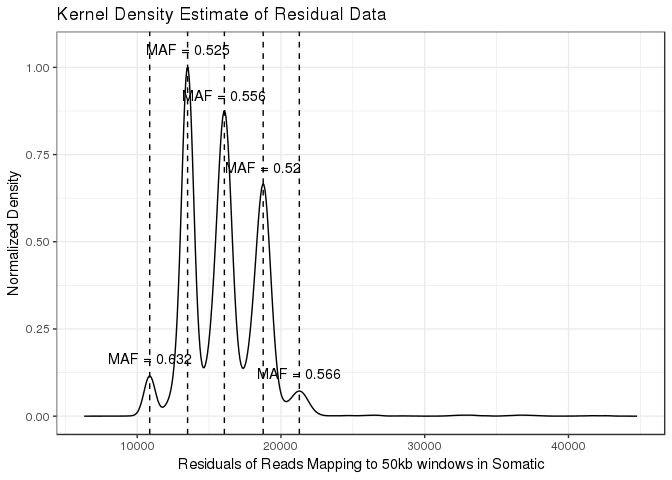
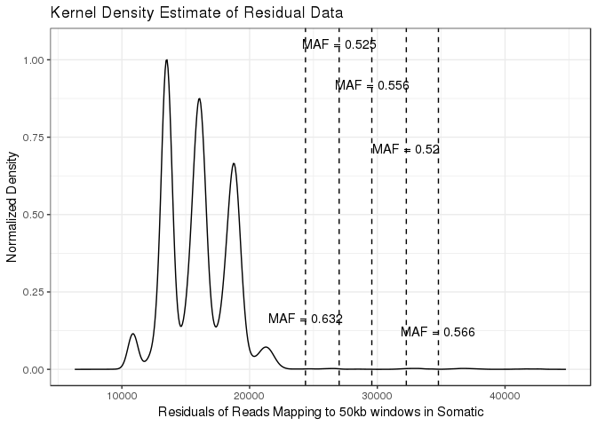

## Data import

First we import the data, formatted as discussed in the README.md. This data is a metastatic tumor biopsy sequenced as part of the Personalized Oncogenomics Project. 


```r
dat <- read.table("examplePOG.txt", stringsAsFactors = F, header = T)
str(dat)
```

```
## 'data.frame':	126254 obs. of  6 variables:
##  $ V4    : int  14904 13843 14757 14472 14044 13728 14379 14222 14155 14054 ...
##  $ V5    : int  1000040 1000014 1000008 1000032 1000016 1000018 1000007 1000022 1000016 1000002 ...
##  $ V6    : chr  "." "." "." "." ...
##  $ window: chr  "1_0" "1_126352" "1_267214" "1_570656" ...
##  $ size  : int  126352 140862 303442 142132 28522 30467 26608 23202 23910 28241 ...
##  $ V7    : num  0.379 0.282 0.295 0.415 0.413 ...
```

## Running Ploidetect

Now we run Ploidetect by calling ```ploidetect()```, and supplying the indices for the columns in our data.

<!-- --><!-- -->

Let's get a look at how the results look.


```r
purity_calls <- result$TC_calls
plots <- result$plots
knitr::kable(purity_calls)
```

      reads_per_copy   zero_copy_depth   Ploidy   tumour_purity   lowest_peak_CN   maf_error   CN_diff   Comparator   model_error   avg_ploidy   unmatchedpct
---  ---------------  ----------------  -------  --------------  ---------------  ----------  --------  -----------  ------------  -----------  -------------
1           2618.132        8252.43365        2       0.3881964                1   0.0356441         2            3      1.179231         2.84      0.0000000
11          2618.132        8252.43365        2       0.3881964                1   0.0356441         1            2      1.179231         2.84      0.0000000
12          2618.132        8252.43365        2       0.3881964                1   0.0356441         1            4      1.179231         2.84      0.0000000
13          2618.132        8252.43365        2       0.3881964                1   0.0356441         3            5      1.179231         2.84      0.0000000
2           4610.332          44.14722        3       0.9952350                2   0.0693242         1            3    118.247765         3.31      0.5918022
21          4693.931        -191.00198        3       1.0207682                2   0.0825702         2            5           Inf         2.96      0.9591626

```r
plots[[1]]
```

<!-- -->

## TC_calls object

ploidetect() returns a list of three objects; TC_calls, or "tumor content calls" describes the models that Ploidetect has used to estimate tumour purity using a variety of different assumptions. It is ordered by the strength of the model, so the first model is most likely to describe the true tumour purity. In this case the purity is predicted to be 39%. 

There are 11 columns in the TC_calls object. The columns correspond to the following values:

* reads_per_copy: The number of reads in a genomic bin that are expected to come from a single copy of the genome

* zero_copy_depth: The number of reads in a genomic bin which is homozygously deleted in the tumor sample. This is the number of reads coming from the contaminating normal.

* Ploidy: the estimated most common copy number state in the genome.

* tumour_purity: the tumour purity

* lowest_peak_CN: used in Ploidetect's modeling. Corresponds to the copy number of the lowest well-represented copy number state in the genome

* maf_error: The median difference between expected and observed germline-heterozygous SNP allele frequencies

* CN_diff: Used in Ploidetect's modeling. See below for more information.

* Comparator: Used in Ploidetect's modeling. See below for more information.

* Model_error: The error computed by Ploidetect for this model. Used to rank models.

* Avg_ploidy: The mean copy number of the genome.

* Unmatchedpct: An estimate of the proportion of the genome that was excluded from the model fit. See below for more information.

## A brief lesson in NGS copy number variation data

Copy number variation is a common type of mutation in most cancers. To explain the methodology, let's use a simple toy genome to go over a few concepts that Ploidetect uses. First, we generate a small toy genome with a decent amount of chromosomal instability.


```r
set.seed(42069)
expand.segments <- function(copynumbers){
  out_cns <- c()
  out_segs <- c()
  for(segment in 1:length(copynumbers)){
    new_size <- round(rnorm(n = 1, mean = 20, sd = 4), digits = 0)
    out_cns <- c(out_cns, rep(copynumbers[segment], times = max(1, new_size)))
    out_segs <- c(out_segs, rep(segment, times = max(1, new_size)))
  }
  out <- data.frame("copynumber" = out_cns, "segment" = out_segs)
  return(out)
}

genome_positions <- 1:10
genome_copynumber <- round(rnorm(n = length(genome_positions), mean = 2, sd = 1), digits = 0)
genome_obj <- expand.segments(genome_copynumber)
genome_obj$start <- 1:nrow(genome_obj)
genome_obj$end <- genome_obj$start + 1

ggplot(genome_obj, aes(x = start, y = copynumber)) + geom_point() + theme_bw()
```

<!-- -->

Okay. So we have a genome. Now let's simulate depth based on the copy numbers we've generated. We'll have the counts follow a normal distribution for simplicity, and assume that the depth is 40x (ie. two-copy regions get 40 aligned reads, one-copy regions get 20, and so forth)


```r
set.seed(42069)
genome_obj$counts <- NA
for(segment in genome_obj$segment){
  current_segment <- genome_obj[genome_obj$segment == segment,]
  genome_obj$counts[genome_obj$segment == segment] <- rnorm(n = nrow(current_segment), mean = 20 * current_segment$copynumber[1])
}
ggplot(genome_obj, aes(x = start, y = counts, color = factor(copynumber))) + geom_point() + theme_bw() + scale_color_viridis(discrete = T)
```

<!-- -->

In this example, the take-home message is that the difference in depth between a one-copy region and a two-copy region is the same as the difference in depth between a two and three-copy region - in this case, the difference is 20. Here's another way to look at the copy number landscape of this genome:


```r
ggplot(genome_obj, aes(x = counts)) + geom_density() + scale_x_continuous(limits = c(0, 100)) + theme_bw()
```

<!-- -->

The density plot communicates the relative quantity and approximate depth of the copy number variants in this genome. In this example genome, we have assumed that there is zero normal contamination. In a real tumour biopsy, this is almost never the case.

Consider that the total reads that align to a given locus can be represented as such:

$\sum reads = reads_t + reads_n$

Where $reads_t$ is the number tumour reads and $reads_n$ is the amount of normal reads.

In the case of 50% tumour purity, the read depth of a locus with equal copy number in both tumour and normal should be equal:

$\sum reads = reads_t + reads_n = 2reads_t = 2reads_n$

Or where the copy number is inequal, it is a weighted average ($C_n$ for normal copy number and $C_t$ for tumour copy number):

$\sum reads = \frac{C_treads_t + C_nreads_n}{2}$

Since (nearly) the entire normal genome should be diploid, we can simplify the above by removing $C_n$:

$\sum reads = \frac{C_treads_t + 2reads_n}{2} = \frac{C_treads_t}{2} + reads_n$

The conclusion of this (long-winded) string of equations is that for any given locus, the number of reads that originate from contaminating normal is a constant, $reads_n$. Since $reads_n$ corresponds to the depth of a two-copy region, we can get the degree of normal contamination ($\alpha$) from the following equation:

$\alpha = \frac{reads_n}{\sum reads}$

Where $\sum reads$ was measured at copy number two. 

Going back to the toy genome, let's add some contaminating counts - we'll aim for 50% tumour purity here.


```r
set.seed(42069)
genome_obj$counts <- genome_obj$counts/2 + rnorm(nrow(genome_obj), mean = 20)
ggplot(genome_obj, aes(x = start, y = counts, color = factor(copynumber))) + geom_point() + theme_bw() + scale_color_viridis(discrete = T)
```

<!-- -->

```r
ggplot(genome_obj, aes(x = counts)) + geom_density() + scale_x_continuous(limits = c(0, 100), breaks = seq(from = 0, to = 100, by = 10)) + theme_bw()
```

<!-- -->

First, how do we determine $reads_n$?

Going back to $\sum reads = reads_t + reads_n$, we just have to find where $reads_t = 0$, which occurs at loci that are homozygously deleted. In our toy case (and in many tumour biopsies), there are no homozygously deleted regions. However, we can predict where it will be. From the above plot, we can see that the difference in depth between each copy number is about 10 counts. This information can be used to determine the depth of a zero-copy region using regression:


```r
fit <- lm(formula = counts~copynumber, data = genome_obj)
predict(object = fit, data.frame("copynumber" = 0))
```

```
##        1 
## 20.04273
```

Now $\sum reads$ for two-copy can be challenging to find, since we need to identify which loci are two-copy. In this example, we have it in ```genome_obj```


```r
genome_obj %>% group_by(copynumber) %>% dplyr::summarise("mean_cov" = mean(counts))
```

```
## # A tibble: 4 x 2
##   copynumber mean_cov
##        <dbl>    <dbl>
## 1          1     29.8
## 2          2     40.1
## 3          3     50.2
## 4          4     59.7
```

Now we just plug these numbers in:


```r
20.4/40.1
```

```
## [1] 0.5087282
```

Tumour purity is 50.9% for our toy example.

The above is the methodology that Ploidetect uses to determine tumour purity. Let's do the estimate for the cancer case ourselves.


```r
result$plots[[1]]
```

<!-- -->

CN=2 occurs at approximately 13000 depth, and CN=1 occurs at about 11000. CN=0 must occur at about 9000. As an aside, Ploidetect knows the copy number state of the peaks in the histogram by fitting the SNP allele frequencies indicted by "MAF = x" in the plot. 


```r
1 - 9000/13000
```

```
## [1] 0.3076923
```

Eyeballing it gives us 31% purity, and Ploidetect predicted 39%.

However, determining the depth of a homozygous deletion may be challenging the case of a messy genome. Notably, in cases of subclonal copy number variation, not all peaks in the density histogram correspond to integer copy number states. In these cases, it is challenging to estimate the depth difference between different integer copy number states. To illustrate this, here's another metastatic tumour, however this one contains subclonal copy number variation, and we'll go through Ploidetect's process to explain how it manages to determine the purity of this biopsy.


```r
knitr::knit_exit()
```

