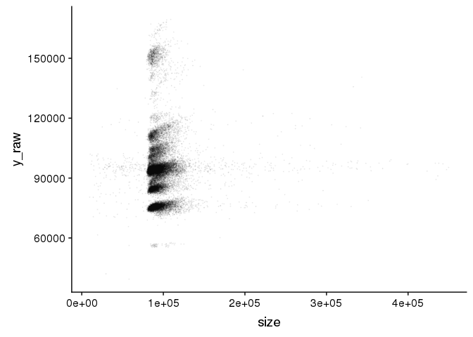
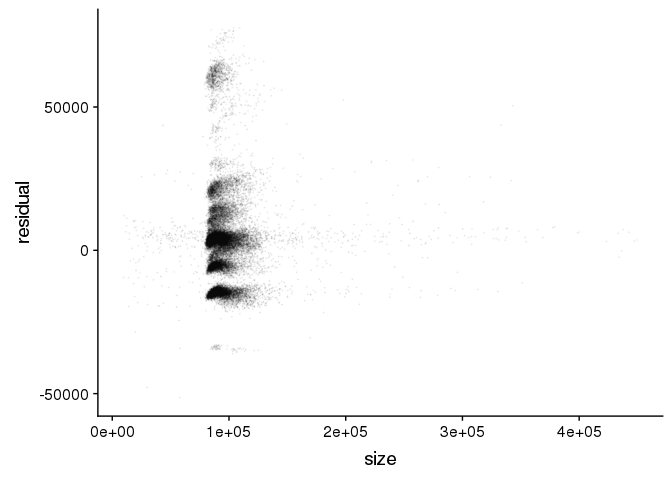
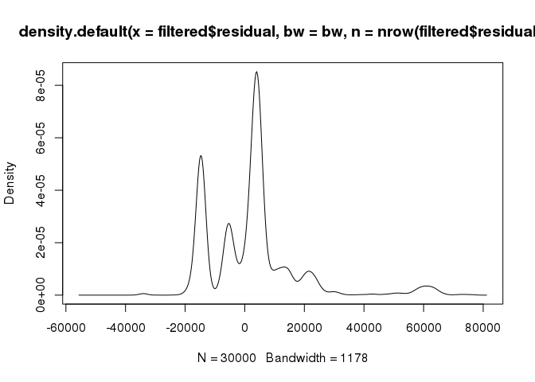
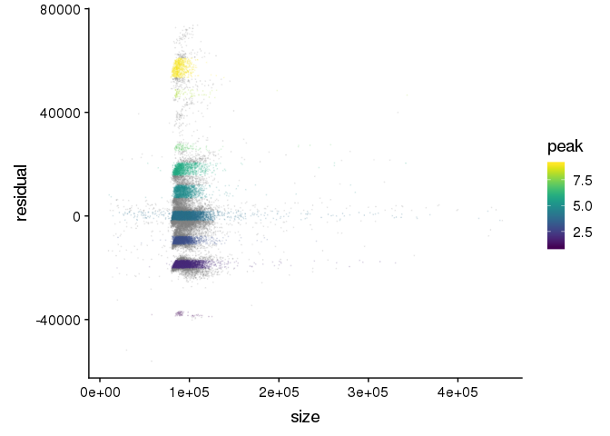
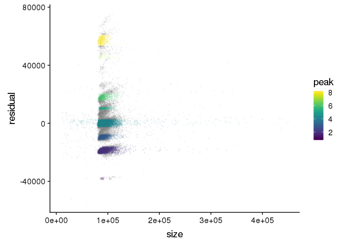
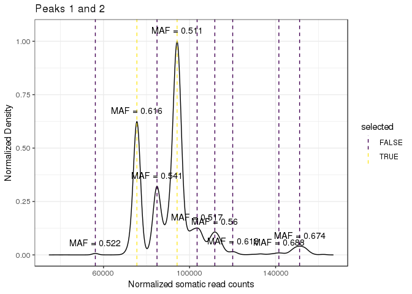
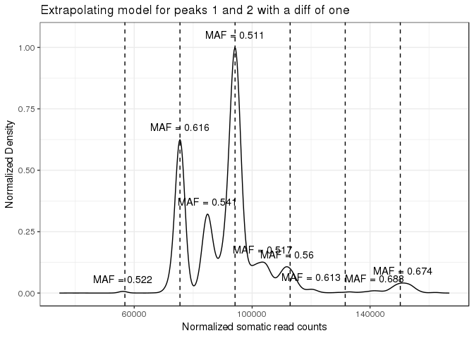

Ploidetect Example Case
================
Luka Culibrk
2/11/2019

Data import
-----------

First we import the data, formatted as discussed in the README.md. This data is a metastatic tumor biopsy sequenced as part of the Personalized Oncogenomics Project.

``` r
dat <- read.table("examplePOG.txt", stringsAsFactors = F, header = T)
str(dat)
```

    ## 'data.frame':    126254 obs. of  6 variables:
    ##  $ V4    : int  14904 13843 14757 14472 14044 13728 14379 14222 14155 14054 ...
    ##  $ V5    : int  1000040 1000014 1000008 1000032 1000016 1000018 1000007 1000022 1000016 1000002 ...
    ##  $ V6    : chr  "." "." "." "." ...
    ##  $ window: chr  "1_0" "1_126352" "1_267214" "1_570656" ...
    ##  $ size  : int  126352 140862 303442 142132 28522 30467 26608 23202 23910 28241 ...
    ##  $ V7    : num  0.379 0.282 0.295 0.415 0.413 ...

Running Ploidetect
------------------

Now we run Ploidetect by calling `ploidetect()`, and supplying the indices for the columns in our data.

Let's get a look at how the results look.

``` r
purity_calls <- result$TC_calls
plots <- result$plots
knitr::kable(purity_calls)
```

|  reads\_per\_copy|  zero\_copy\_depth|  Ploidy|  tumour\_purity|  lowest\_peak\_CN|  maf\_error|  CN\_diff|  Comparator|  model\_error|  avg\_ploidy|  unmatchedpct|
|-----------------:|------------------:|-------:|---------------:|-----------------:|-----------:|---------:|-----------:|-------------:|------------:|-------------:|
|          2625.664|           8238.459|       2|       0.3892818|                 1|   0.0357246|         2|           3|      1.214356|         2.83|             0|

``` r
plots[[3]]
```


TC\_calls object
----------------

ploidetect() returns a list of three objects; TC\_calls, or "tumor content calls" describes the models that Ploidetect has used to estimate tumour purity using a variety of different assumptions. It is ordered by the strength of the model, so the first model is most likely to describe the true tumour purity. In this case the purity is predicted to be 39%.

There are 11 columns in the TC\_calls object. The columns correspond to the following values:

-   reads\_per\_copy: The number of reads in a genomic bin that are expected to come from a single copy of the genome

-   zero\_copy\_depth: The number of reads in a genomic bin which is homozygously deleted in the tumor sample. This is the number of reads coming from the contaminating normal.

-   Ploidy: the estimated most common copy number state in the genome.

-   tumour\_purity: the tumour purity

-   lowest\_peak\_CN: used in Ploidetect's modeling. Corresponds to the copy number of the lowest well-represented copy number state in the genome

-   maf\_error: The median difference between expected and observed germline-heterozygous SNP allele frequencies

-   CN\_diff: Used in Ploidetect's modeling. See below for more information.

-   Comparator: Used in Ploidetect's modeling. See below for more information.

-   Model\_error: The error computed by Ploidetect for this model. Used to rank models.

-   Avg\_ploidy: The mean copy number of the genome.

-   Unmatchedpct: An estimate of the proportion of the genome that was excluded from the model fit. See below for more information.

A brief lesson in NGS copy number variation data
------------------------------------------------

Copy number variation is a common type of mutation in most cancers. To explain the methodology, let's use a simple toy genome to go over a few concepts that Ploidetect uses. First, we generate a small toy genome with a decent amount of chromosomal instability.

``` r
set.seed(42069)
expand.segments <- function(copynumbers){
  out_cns <- c()
  out_segs <- c()
  for(segment in 1:length(copynumbers)){
    new_size <- round(rnorm(n = 1, mean = 20, sd = 4), digits = 0)
    out_cns <- c(out_cns, rep(copynumbers[segment], times = max(1, new_size)))
    out_segs <- c(out_segs, rep(segment, times = max(1, new_size)))
  }
  out <- data.frame("copynumber" = out_cns, "segment" = out_segs)
  return(out)
}

genome_positions <- 1:10
genome_copynumber <- round(rnorm(n = length(genome_positions), mean = 2, sd = 1), digits = 0)
genome_obj <- expand.segments(genome_copynumber)
genome_obj$start <- 1:nrow(genome_obj)
genome_obj$end <- genome_obj$start + 1

ggplot(genome_obj, aes(x = start, y = copynumber)) + geom_point() + theme_bw()
```


Okay. So we have a genome. Now let's simulate depth based on the copy numbers we've generated. We'll have the counts follow a normal distribution for simplicity, and assume that the depth is 40x (ie. two-copy regions get 40 aligned reads, one-copy regions get 20, and so forth)

``` r
set.seed(42069)
genome_obj$counts <- NA
for(segment in genome_obj$segment){
  current_segment <- genome_obj[genome_obj$segment == segment,]
  genome_obj$counts[genome_obj$segment == segment] <- rnorm(n = nrow(current_segment), mean = 20 * current_segment$copynumber[1])
}
ggplot(genome_obj, aes(x = start, y = counts, color = factor(copynumber))) + geom_point() + theme_bw() + scale_color_viridis(discrete = T)
```


In this example, the take-home message is that the difference in depth between a one-copy region and a two-copy region is the same as the difference in depth between a two and three-copy region - in this case, the difference is 20. Here's another way to look at the copy number landscape of this genome:

``` r
ggplot(genome_obj, aes(x = counts)) + geom_density() + scale_x_continuous(limits = c(0, 100)) + theme_bw()
```


The density plot communicates the relative quantity and approximate depth of the copy number variants in this genome. In this example genome, we have assumed that there is zero normal contamination. In a real tumour biopsy, this is almost never the case.

Consider that the total reads that align to a given locus can be represented as such:


Where  is the number tumour reads and  is the amount of normal reads.

In the case of 50% tumour purity, the read depth of a locus with equal copy number in both tumour and normal should be equal:


Or where the copy number is inequal, it is a weighted average ( for normal copy number and  for tumour copy number):


Since (nearly) the entire normal genome should be diploid, we can simplify the above by removing :


The conclusion of this (long-winded) string of equations is that for any given locus, the number of reads that originate from contaminating normal is a constant, . Since  corresponds to the depth of a two-copy region, we can get the degree of normal contamination () from the following equation:


Where  was measured at copy number two.

Going back to the toy genome, let's add some contaminating counts - we'll aim for 50% tumour purity here.

``` r
set.seed(42069)
genome_obj$counts <- genome_obj$counts/2 + rnorm(nrow(genome_obj), mean = 20)
ggplot(genome_obj, aes(x = start, y = counts, color = factor(copynumber))) + geom_point() + theme_bw() + scale_color_viridis(discrete = T)
```


``` r
ggplot(genome_obj, aes(x = counts)) + geom_density() + scale_x_continuous(limits = c(0, 100), breaks = seq(from = 0, to = 100, by = 10)) + theme_bw()
```


First, how do we determine ?

Going back to , we just have to find where , which occurs at loci that are homozygously deleted. In our toy case (and in many tumour biopsies), there are no homozygously deleted regions. However, we can predict where it will be. From the above plot, we can see that the difference in depth between each copy number is about 10 counts. This information can be used to determine the depth of a zero-copy region using regression:

``` r
fit <- lm(formula = counts~copynumber, data = genome_obj)
predict(object = fit, data.frame("copynumber" = 0))
```

    ##        1 
    ## 20.04273

Now  for two-copy can be challenging to find, since we need to identify which loci are two-copy. In this example, we have it in `genome_obj`

``` r
genome_obj %>% group_by(copynumber) %>% dplyr::summarise("mean_cov" = mean(counts))
```

    ## # A tibble: 4 x 2
    ##   copynumber mean_cov
    ##        <dbl>    <dbl>
    ## 1          1     29.8
    ## 2          2     40.1
    ## 3          3     50.2
    ## 4          4     59.7

Now we just plug these numbers in:

``` r
20.4/40.1
```

    ## [1] 0.5087282

Tumour purity is 50.9% for our toy example.

The above is the methodology that Ploidetect uses to determine tumour purity. Let's do the estimate for the cancer case ourselves.

``` r
result$plots[[1]]
```


CN=2 occurs at approximately 13000 depth, and CN=1 occurs at about 11000. CN=0 must occur at about 9000. As an aside, Ploidetect knows the copy number state of the peaks in the histogram by fitting the SNP allele frequencies indicted by "MAF = x" in the plot.

``` r
1 - 9000/13000
```

    ## [1] 0.3076923

Eyeballing it gives us 31% purity, and Ploidetect predicted 39%.

However, determining the depth of a homozygous deletion may be challenging the case of a messy genome. Notably, in cases of subclonal copy number variation, not all peaks in the density histogram correspond to integer copy number states. In these cases, it is challenging to estimate the depth difference between different integer copy number states. To illustrate this, here's another metastatic tumour, however this one contains subclonal copy number variation, and we'll go through Ploidetect's process to explain how it manages to determine the purity of this biopsy.

``` r
clonalcase <- read.table("clonal_example.txt", sep = "\t", header = T, stringsAsFactors = F)
str(clonalcase)
```

    ## 'data.frame':    152304 obs. of  6 variables:
    ##  $ V4    : int  14334 16122 26613 16676 16590 16570 16715 16624 16854 17290 ...
    ##  $ V5    : int  1000002 1000034 1000005 1000021 1000004 1000017 1000019 1000008 1000020 1000011 ...
    ##  $ V6    : chr  "." "." "." "." ...
    ##  $ window: chr  "1_0" "1_126577" "1_536971" "1_600543" ...
    ##  $ size  : int  126577 410394 63572 113805 23282 25173 23165 22789 18340 25249 ...
    ##  $ V7    : num  0.379 0.275 0.439 0.426 0.401 ...

Here we're going to go through Ploidetect's internals to demonstrate what it's doing, step by step. First let's set the variables that would otherwise be handled by the parameters of ploidetect()

``` r
all_data <- clonalcase
normal = 2
tumour = 1
avg_allele_freq =3
window_id = 4
window_size = 5
GC = 6
verbose = F
rerun = F
lowest = NA
cndiff = NA
comp = NA
nomaf = F
```

Note that you won't be able to call these functions yourself as they aren't exported by the namespace of the package.

First, we call ploidetect\_preprocess, which performs basic preprocessing of the data. It corrects for lingering GC biases using a loess fit and also corrects the read depth using the normal read depth, since using constant depth bins can fail at the terminal end of the chromsome due to being truncated by the end of the chromosome. We get three objects, one of which is important for our sake.

``` r
preprocess_output <- ploidetect_preprocess(all_data = all_data)
str(preprocess_output)
```

    ## List of 3
    ##  $ x           :'data.frame':    149837 obs. of  8 variables:
    ##   ..$ y_raw          : num [1:149837] 26614 16590 16570 16715 16624 ...
    ##   ..$ x_raw          : int [1:149837] 1000005 1000004 1000017 1000019 1000008 1000020 1000011 1000032 1000021 1000006 ...
    ##   ..$ window         : chr [1:149837] "1_536971" "1_714348" "1_737630" "1_762803" ...
    ##   ..$ maf            : chr [1:149837] "." "." "0.384615" "0.513514" ...
    ##   ..$ size           : int [1:149837] 63572 23282 25173 23165 22789 18340 25249 29427 27180 27812 ...
    ##   ..$ GC             : num [1:149837] 0.439 0.401 0.428 0.465 0.46 ...
    ##   ..$ residual       : num [1:149837] 8423 -1410 -1558 -1624 -1696 ...
    ##   ..$ normalized_size: int [1:149837] 63572 23282 25173 23165 22789 18340 25249 29427 27180 27812 ...
    ##  $ maxpeak     : num 18840
    ##  $ highoutliers:'data.frame':    0 obs. of  6 variables:
    ##   ..$ V4    : num(0) 
    ##   ..$ V5    : int(0) 
    ##   ..$ V6    : chr(0) 
    ##   ..$ window: chr(0) 
    ##   ..$ size  : int(0) 
    ##   ..$ V7    : num(0)

``` r
filtered <- preprocess_output$x
maxpeak <- preprocess_output$maxpeak
highoutliers <- preprocess_output$highoutliers
```

filtered contains the corrected and filtered read depths for our data. Let's compare before and after (and some filtering to visualize the difference more easily).

``` r
filtered %>% filter (y_raw < 50000) %>% ggplot(aes(x = size)) + geom_point(aes(y = y_raw), alpha = 0.05, size = 0.1)
```



``` r
filtered %>% filter (y_raw < 50000) %>% ggplot(aes(x = size)) + geom_point(aes(y = residual), alpha = 0.05, size = 0.1)
```



It's not much, but we have reduced the variation in the read depth data somewhat. If you were wondering, highoutliers contains exceptionally high depth outliers that are either caused by sequencing error or other causes, and we exclude these bins to limit their interference on the modeling. maxpeak is the most common read depth that we observe in the data.

Ploidetect uses a kernel density estimation to find peaks in the depth histogram. We use a simple heuristic to get a decent bandwidth for peak calling.

``` r
bw = maxpeak/80
```

Next, we need to call peaks in the density histogram. The histogram, for reference:

``` r
plot(density(filtered$residual, bw = bw, n = nrow(filtered$residual)))
```



Ploidetect calls peaks using a simple derivative approach. It takes the second derivative of the kernel density estimation and detects the point where the sign goes negative.

``` r
library(kedd)
plot(dkde(filtered$residual, deriv.order = 2, h = bw))
```


Of course, since we used a simple heuristic for bandwidth, we should probably throw another heuristic in for good measure. What if we detect only one peak in the data? Either there is no copy number variation, or Ploidetect needs to reduce the bandwidth. So as a first pass Ploidetect filters the data relatively stringently, by using a quantile filter from the 1st to 99th percentiles of read depth and calls peaks. Don't worry too much about what all of the variables mean.

``` r
allPeaks <- peakcaller(filtered[findInterval(filtered$residual, vec = quantile(filtered$residual, probs = c(0.01, 0.99))) == 1,], bw)
knitr::kable(allPeaks)
```

|      start|         end|     height|         pos|     trough|  ratiotrough|  troughdiff|       diff|
|----------:|-----------:|----------:|-----------:|----------:|------------:|-----------:|----------:|
|    351.929|   1279.0887|  1.0000000|    793.7871|  0.2411404|    0.2411404|   0.7588596|      0.000|
|  -3356.710|  -2500.8700|  0.6296475|  -2936.8795|  0.0855762|    0.1359112|   0.5440713|   3730.667|
|  -1466.730|   -717.8706|  0.3329411|  -1028.9929|  0.2411404|    0.7242733|   0.0918007|   1822.780|
|   2420.208|   3133.4081|  0.1503462|   2420.2417|  0.1503483|    1.0000143|  -0.0000022|   1626.455|
|   3953.588|   4987.7275|  0.1164078|   4282.5528|  0.0981493|    0.8431505|   0.0182585|   3488.766|
|  11549.165|  12654.6250|  0.0438817|  12159.5060|  0.0093147|    0.2122675|   0.0345671|  11365.719|
|   9623.526|  10051.4459|  0.0093147|  10051.4255|  0.0093147|    1.0000000|   0.0000000|   9257.638|
|   8125.806|   8767.6863|  0.0050482|   8537.5195|  0.0047455|    0.9400340|   0.0003027|   7743.732|

So we've called more than one peak, we can continue with the same bandwidth, but a less stringent filter (99.9th percentile only). If Ploidetect called only one then it would try again by halving the bandwidth

``` r
if(nrow(allPeaks) == 1){
  warning("Zero peaks detected. Attempting peak calling with lower bandwidth")
  bw = bw/2
  allPeaks <- peakcaller(filtered[findInterval(filtered$residual, vec = quantile(filtered$residual, probs = c(0.01, 0.99))) == 1,], bw)
}

## Now we peak call with a much more permissive quantile filter
allPeaks <- peakcaller(filtered[findInterval(filtered$residual, vec = quantile(filtered$residual, probs = c(0, 0.999))) == 1,], bw)
knitr::kable(allPeaks)
```

|       start|         end|     height|         pos|     trough|  ratiotrough|  troughdiff|       diff|
|-----------:|-----------:|----------:|-----------:|----------:|------------:|-----------:|----------:|
|    335.8908|   1321.3700|  1.0000000|    793.7608|  0.2411823|    0.2411823|   0.7588177|      0.000|
|  -3332.2817|  -2511.0491|  0.6297114|  -2937.0314|  0.0856267|    0.1359777|   0.5440847|   3730.792|
|  -1470.8210|   -704.3372|  0.3329780|  -1029.0959|  0.2411823|    0.7243191|   0.0917957|   1822.857|
|   2416.3469|   3128.0819|  0.1504597|   2416.5074|  0.1504630|    1.0000218|  -0.0000033|   1622.747|
|   3949.3145|   4989.5426|  0.1164566|   4282.5466|  0.0981991|    0.8432250|   0.0182575|   3488.786|
|  11559.4038|  13037.6226|  0.0449678|  12240.2713|  0.0094560|    0.2102845|   0.0355117|  11446.511|
|   9643.1943|  10081.1850|  0.0094560|  10081.1418|  0.0094560|    1.0000000|   0.0000000|   9287.381|
|  -7164.7008|  -6452.9659|  0.0072177|  -6838.5326|  0.0003312|    0.0458850|   0.0068865|   7632.293|
|   8164.9755|   8767.2128|  0.0051032|   8537.4101|  0.0048005|    0.9406837|   0.0003027|   7743.649|

So you can see the less stringent filtering resulted in another peak being called. Next we do a bit of housekeeping and center the positions and read depths around zero

``` r
filtered$residual <- filtered$residual - allPeaks$pos[1]
allPeaks$start <- allPeaks$start - allPeaks$pos[1]
allPeaks$end <- allPeaks$end - allPeaks$pos[1]
allPeaks$pos <- allPeaks$pos - allPeaks$pos[1]
```

next we need to do a bit of work with the allele frequency data. Specifically, we want to determine the SNP allele frequency that best represents each peak. This is done by ploidetect\_processallpeaks. We also map the data to their respective peaks. This doesn't map them all, because peak boundaries end up being fairly conservative due to the kernel density approach.

``` r
output <- ploidetect_processallpeaks(filtered, allPeaks)
filtered <- output$filtered
allPeaks <- output$allPeaks
filtered %>% ggplot(aes(x = size, y = residual, color = peak)) + geom_point(size = 0.1, alpha = 0.1) + scale_color_viridis()
```



This is where Ploidetect presents you with its first plot:

``` r
filteredforplot <- filtered[findInterval(filtered$residual, vec = quantile(filtered$residual, probs = c(0.01, 0.999))) <= 1,]
filteredforplot$residual <- filteredforplot$residual + maxpeak
plot <- ggplot(data = filteredforplot, mapping = aes_string(x = "size", y = "residual", color = "mafflipped")) + geom_point(size = 0.1, alpha = 0.1) +
  #xlab("Window size") + 
  xlab("Window size of constant-coverage bins") + 
  #ylab("Reads mapping to bins in Somatic") + 
  ylab("Normalized somatic read counts") + 
  #ggtitle(paste0("Coverage vs normalized bin size (Surrogate for Mappability + GC bias)")) + 
  ggtitle(paste0("Coverage Plot for Filtered and Normalised Data")) + 
  scale_colour_viridis(option = "plasma", name = "Major Allele\n Frequency") +
  #scale_x_continuous(limits = quantile(filtered$size, probs = c(0.05, 0.99))) +
  theme_bw(base_size = 12)
plot
```



And now it generates the density plot, which also illustrates the peaks that have been called in this density histogram

``` r
den <- density(filteredforplot$residual, bw = bw)
dendf <- data.frame(x = den$x, y = den$y)
# Normalize the density to 0->1 range
dendf$y <- (dendf$y - min(dendf$y))/(max(dendf$y) - min(dendf$y))
plot <- ggplot(data = dendf, mapping = aes(x = x, y = y)) + geom_line() + 
  xlab("Normalized somatic read counts") + 
  ylab("Normalized Density") + 
  ggtitle(paste0("Kernel Density Estimate of Count Data")) + 
  geom_vline(data = allPeaks, aes(xintercept = pos + maxpeak), linetype = 2) + 
  geom_text(data = allPeaks, aes(x = pos + maxpeak, y = allPeaks$height + 0.05, label = paste0("MAF = ", round(mainmaf, digits = 3)))) +
  theme_bw()
plot
```


I've already told you that this case has subclonal copy number variation. I'm going to spoil it right away and tell you that the peaks immediately adjacent to the tallest one are the result of subclonal copy number events. The reasons for this will become more clear in a bit.

If you recall with the toy case, we used the plot information to estimate the number of reads that align to a single copy of the tumour genome, which we will refer to as the number of reads per copy. This is done by Ploidetect by selecting a set of peaks that it reasonably believes to correspond to integer copy number variants, and using those peaks to determine the reads per copy. Here's the table of peaks again:

``` r
allPeaks %>% arrange(pos) %>% knitr::kable()
```

|       start|         end|     height|        pos|     trough|  ratiotrough|  troughdiff|       diff|  npeak|    mainmaf|
|-----------:|-----------:|----------:|----------:|----------:|------------:|-----------:|----------:|------:|----------:|
|  -7958.4616|  -7246.7266|  0.0072177|  -7632.293|  0.0003312|    0.0458850|   0.0068865|   7632.293|      1|  0.5318107|
|  -4126.0425|  -3304.8098|  0.6297114|  -3730.792|  0.0856267|    0.1359777|   0.5440847|   3730.792|      2|  0.6154575|
|  -2264.5818|  -1498.0980|  0.3329780|  -1822.857|  0.2411823|    0.7243191|   0.0917957|   1822.857|      3|  0.5670986|
|   -457.8699|    527.6092|  1.0000000|      0.000|  0.2411823|    0.2411823|   0.7588177|      0.000|      4|  0.5180695|
|   1622.5861|   2334.3211|  0.1504597|   1622.747|  0.1504630|    1.0000218|  -0.0000033|   1622.747|      5|  0.5165716|
|   3155.5538|   4195.7818|  0.1164566|   3488.786|  0.0981991|    0.8432250|   0.0182575|   3488.786|      6|  0.5873103|
|   7371.2147|   7973.4520|  0.0051032|   7743.649|  0.0048005|    0.9406837|   0.0003027|   7743.649|      7|  0.5888951|
|   8849.4335|   9287.4243|  0.0094560|   9287.381|  0.0094560|    1.0000000|   0.0000000|   9287.381|      8|  0.7591816|
|  10765.6431|  12243.8619|  0.0449678|  11446.511|  0.0094560|    0.2102845|   0.0355117|  11446.511|      9|  0.6733350|

So one example model might select peaks 1, 2, 4, 6, 7, and 9 (peaks are numbered by depth). Then, we can compute the tumour purity using this information. To generate these models, Ploidetect needs to first perform a rough estimation step. Iteratively, Ploidetect selects the tallest peak (peak 4 in this case) and another peak in the dataset to serve as a comparator. For this case, let's select peak 2.

``` r
allPeaks_plot <- allPeaks
allPeaks_plot$selected <- F
allPeaks_plot$selected[allPeaks$npeak %in% c(2, 4)] <- T
plot <- ggplot(data = dendf, mapping = aes(x = x, y = y)) + geom_line() + 
  xlab("Normalized somatic read counts") + 
  ylab("Normalized Density") + 
  ggtitle(paste0("Peaks 1 and 2")) + 
  geom_vline(data = allPeaks_plot, aes(xintercept = pos + maxpeak, color = selected), linetype = 2) + 
  geom_text(data = allPeaks_plot, aes(x = pos + maxpeak, y = allPeaks$height + 0.05, label = paste0("MAF = ", round(mainmaf, digits = 3)))) +
  theme_bw() + 
  scale_color_viridis(discrete = T)
plot
```



The difference in coverage between peaks 1 and 2:

``` r
allPeaks$diff[which(allPeaks$npeak == 2)]
```

    ## [1] 3730.792

If we move left and right in steps of 3730 reads, we would notice that we land very close to peak 1, peak 6, peak 7, and peak 9:

``` r
diffvalue <- allPeaks$diff[which(allPeaks$npeak == 2)]
positions <- seq(from = -2*diffvalue, by = diffvalue, length.out = 6) + maxpeak

allPeaks_plot <- allPeaks
allPeaks_plot$selected <- F
allPeaks_plot$selected[allPeaks$npeak %in% c(2, 4)] <- T
plot <- ggplot(data = dendf, mapping = aes(x = x, y = y)) + geom_line() + 
  xlab("Normalized somatic read counts") + 
  ylab("Normalized Density") + 
  ggtitle(paste0("Extrapolating model for peaks 1 and 2 with a diff of one")) + 
  geom_vline(data = data.frame(positions = positions), aes(xintercept = positions), linetype = 2) + 
  geom_text(data = allPeaks_plot, aes(x = pos + maxpeak, y = allPeaks$height + 0.05, label = paste0("MAF = ", round(mainmaf, digits = 3)))) +
  theme_bw() + 
  scale_color_viridis(discrete = T)
plot
```



This model was generated by selecting peak 2 as the comparator, and assuming a copy number difference between peak 1 and 2 of one. This model has matched with peaks 1, 2, 4, 6, 7, and 9.

Alternatively, we might assume that peak 2 is two copies away from peak 1, in which case we would move left and right in steps of 1865 reads.

``` r
diffvalue <- allPeaks$diff[which(allPeaks$npeak == 2)]/2
positions <- seq(from = -4*diffvalue, by = diffvalue, length.out = 12) + maxpeak

allPeaks_plot <- allPeaks
allPeaks_plot$selected <- F
allPeaks_plot$selected[allPeaks$npeak %in% c(2, 4)] <- T
plot <- ggplot(data = dendf, mapping = aes(x = x, y = y)) + geom_line() + 
  xlab("Normalized somatic read counts") + 
  ylab("Normalized Density") + 
  ggtitle(paste0("Extrapolating model for peaks 1 and 2 with a diff of two")) + 
  geom_vline(data = data.frame(positions = positions), aes(xintercept = positions), linetype = 2) + 
  geom_text(data = allPeaks_plot, aes(x = pos + maxpeak, y = allPeaks$height + 0.05, label = paste0("MAF = ", round(mainmaf, digits = 3)))) +
  theme_bw() + 
  scale_color_viridis(discrete = T)
plot
```


This model was generated again by selecting peak 2 as the comparator, and assuming a copy number difference of two. While this model matched with all of the peaks, it predicted that there should be peaks in locations we don't find any, for example between peaks 1 and 2 or 6 and 7.

ploidetect\_roughmodels will do this for each peak, as well as a variety of copy number differences

``` r
xdists <- ploidetect_roughmodels(allPeaks = allPeaks, maxpeak, verbose = verbose, rerun = rerun)
str(xdists)
```

    ## Classes 'grouped_df', 'tbl_df', 'tbl' and 'data.frame':  32 obs. of  5 variables:
    ##  $ unmatched                           : chr  "2_3_5_6_9_7" "2_3_5_6_9_8" "2_3_5_6_9_8" "2_3_5_6_9_8" ...
    ##  $ predunmatched                       : chr  "" "" "13677.6624033367_24002.5281279518" "13751.8997093939_23928.2908218946" ...
    ##  $ reads_per_copy                      : num  8830 7679 2566 2554 698 ...
    ##  $ Copy_number_difference_between_peaks: num  1 1 3 3 5 5 2 4 3 1 ...
    ##  $ Comparator_peak_rank                : num  7 8 9 8 5 4 4 5 5 2 ...
    ##  - attr(*, "vars")= chr "unmatched"
    ##  - attr(*, "drop")= logi TRUE

You can ignore the "mean\_err" variable here. Each row of the xdists object describes a model, such as the ones above, that Ploidetect has fit to the data. The unmatched variable is a list of the peaks that were not matched by the model, and the predunmatched variable lists the positions of peaks that were predicted to occur but were not detected. This information is used as input to modelbuilder\_iterative(), which is a fairly verbose function that takes this information and selects a model that balances fitting a maximum number of peaks, predicting few imaginary peaks and minimizing the difference between predicted and observed allele frequencies using a dirty heuristic algorithm.

``` r
allPeaks$pos <- allPeaks$pos + maxpeak
TC_calls <- list()

for(i in 1:nrow(xdists)){
  modelbuilder_output <- modelbuilder_iterative(xdists[i,], allPeaks = allPeaks, lowest = lowest, filtered = filtered, strict = T, get_homd = F, mode = "TC", nomaf = nomaf, rerun = rerun, maxpeak = maxpeak, bw = bw)
  TC_calls <- c(TC_calls, list(modelbuilder_output$out))
  plots <- c(plots, list(modelbuilder_output$outplot))
}

TC_calls <- do.call(rbind.data.frame, TC_calls) %>% arrange(model_error)
knitr::kable(TC_calls)
```

|  reads\_per\_copy|  zero\_copy\_depth|  Ploidy|  tumour\_purity|  lowest\_peak\_CN|  maf\_error|  CN\_diff|  Comparator|  model\_error|  avg\_ploidy|  unmatchedpct|
|-----------------:|------------------:|-------:|---------------:|-----------------:|-----------:|---------:|-----------:|-------------:|------------:|-------------:|
|          3682.480|          11445.009|       2|       0.3915456|                 0|   0.0356336|         1|           5|      1.967809|         1.71|     0.2253133|
|          3737.881|          11356.660|       2|       0.3969623|                 0|   0.0357153|         1|           2|      2.274904|         1.79|     0.2098118|
|          1820.285|          11510.851|       4|       0.2402791|                 0|   0.0809966|         4|           9|      2.673910|         3.45|     0.0165224|
|          1820.285|          11510.851|       4|       0.2402791|                 0|   0.0809966|         4|           8|      2.673910|         3.45|     0.0165224|
|          1820.285|          11510.851|       4|       0.2402791|                 0|   0.0809966|         1|           3|      2.673910|         3.45|     0.0165224|
|          1820.285|          11510.851|       4|       0.2402791|                 0|   0.0809966|         2|           5|      2.673910|         3.45|     0.0165224|
|          1848.756|          11420.826|       4|       0.2445713|                 0|   0.0808608|         2|           2|      7.972505|         3.47|     0.0158165|
|          3593.498|          11586.360|       2|       0.3828296|                 0|   0.0355770|         3|           7|     12.301052|         1.71|     0.2253133|
|          1958.734|          11065.233|       4|       0.2614661|                 2|   0.0271856|         1|           4|     17.393926|         3.57|     0.0022775|
|          2425.891|           9761.711|       4|       0.3320070|                 1|   0.0326762|         5|           6|     27.938661|         3.25|     0.0711396|
|          2042.118|          10809.415|       4|       0.2742267|                 0|   0.0826781|         5|           7|     28.913399|         3.54|     0.0010209|
|          1942.737|           7243.240|       6|       0.3491396|                 1|   0.0297211|         5|           9|     30.615134|         5.55|     0.0010209|
|          1942.737|           7243.240|       6|       0.3491396|                 1|   0.0297211|         5|           8|     30.615134|         5.55|     0.0010209|
|          8569.138|           1715.151|       2|       0.9090271|                 1|   0.0640404|         1|           7|           Inf|         2.00|     0.9980375|
|          7678.529|           3483.695|       2|       0.8150979|                 1|   0.0605780|         1|           8|           Inf|         2.00|     0.9984283|

And we're back to the familiar output data! As an aside, we have essentially mirrored Ploidetect's default behavior:

``` r
subclonalcalls <- ploidetect(clonalcase)
subclonalcalls$TC_calls %>% knitr::kable()
```

|     |  reads\_per\_copy|  zero\_copy\_depth|  Ploidy|  tumour\_purity|  lowest\_peak\_CN|  maf\_error|  CN\_diff|  Comparator|  model\_error|  avg\_ploidy|  unmatchedpct|
|-----|-----------------:|------------------:|-------:|---------------:|-----------------:|-----------:|---------:|-----------:|-------------:|------------:|-------------:|
| 01  |          3682.480|          11445.009|       2|       0.3915456|                 0|   0.0356336|         1|           5|      1.967809|         1.71|     0.2253133|
| 0   |          3737.881|          11356.660|       2|       0.3969623|                 0|   0.0357153|         1|           2|      2.274904|         1.79|     0.2098118|
| 05  |          1820.285|          11510.851|       4|       0.2402791|                 0|   0.0809966|         4|           9|      2.673910|         3.45|     0.0165224|
| 06  |          1820.285|          11510.851|       4|       0.2402791|                 0|   0.0809966|         4|           8|      2.673910|         3.45|     0.0165224|
| 07  |          1820.285|          11510.851|       4|       0.2402791|                 0|   0.0809966|         1|           3|      2.673910|         3.45|     0.0165224|
| 08  |          1820.285|          11510.851|       4|       0.2402791|                 0|   0.0809966|         2|           5|      2.673910|         3.45|     0.0165224|
| 04  |          1848.756|          11420.826|       4|       0.2445713|                 0|   0.0808608|         2|           2|      7.972505|         3.47|     0.0158165|
| 02  |          3593.498|          11586.360|       2|       0.3828296|                 0|   0.0355770|         3|           7|     12.301052|         1.71|     0.2253133|
| 2   |          1958.734|          11065.233|       4|       0.2614661|                 2|   0.0271856|         1|           4|     17.393926|         3.57|     0.0022775|
| 12  |          2425.891|           9761.711|       4|       0.3320070|                 1|   0.0326762|         5|           6|     27.938661|         3.25|     0.0711396|
| 03  |          2042.118|          10809.415|       4|       0.2742267|                 0|   0.0826781|         5|           7|     28.913399|         3.54|     0.0010209|
| 13  |          1942.737|           7243.240|       6|       0.3491396|                 1|   0.0297211|         5|           9|     30.615134|         5.55|     0.0010209|
| 14  |          1942.737|           7243.240|       6|       0.3491396|                 1|   0.0297211|         5|           8|     30.615134|         5.55|     0.0010209|
| 1   |          8569.138|           1715.151|       2|       0.9090271|                 1|   0.0640404|         1|           7|           Inf|         2.00|     0.9980375|
| 11  |          7678.529|           3483.695|       2|       0.8150979|                 1|   0.0605780|         1|           8|           Inf|         2.00|     0.9984283|

So now, an interesting thought arises; what if we decided that Ploidetect's top model (Ploidy = 2, purity = 0.3915456) was wrong? What if, based on our own inspection of the data and what we have learned so far, we decided that Ploidetect made a mistake and the correct model should have been the second on the list? Or what if the model looks correct but the ploidy is wrong? This is why Ploidetect provides a ton of plots for you - it helps with manual review.

The first two plots that Ploidetect returns will be a scatter plot of the coverage and a plot of all of the called peaks:

``` r
subclonalcalls$plots[1:2]
```

    ## [[1]]


    ## 
    ## [[2]]


The next plots will illustrate the models that Ploidetect used for each of the purity predictions

``` r
subclonalcalls$plots[c(3, 5)]
```

    ## [[1]]


    ## 
    ## [[2]]


So let's say that the other model looks more correct for whatever reason. We can force Ploidetect to pick this model, using the information in the table or the plot (note the CN\_diff and comparator values):

``` r
newsubclonalcalls <- ploidetect(clonalcase, cndiff = 4, comp = 9, lowest = 0)
newsubclonalcalls$TC_calls %>% knitr::kable()
```

|     |  reads\_per\_copy|  zero\_copy\_depth|  Ploidy|  tumour\_purity|  lowest\_peak\_CN|  maf\_error|  CN\_diff|  Comparator|  model\_error|  avg\_ploidy|  unmatchedpct|
|-----|-----------------:|------------------:|-------:|---------------:|-----------------:|-----------:|---------:|-----------:|-------------:|------------:|-------------:|
| 0   |          1820.285|           11510.85|       4|       0.2402791|                 0|   0.0809966|         4|           9|       2.67391|         3.45|     0.0165224|

``` r
newsubclonalcalls$plots[3]
```

    ## [[1]]


These features (and indeed, this tutorial) is there for the inevitable cases where Ploidetect gets it wrong. The way we could tell for this case is by looking at peak 5; it has an allele frequency of 0.517. If it were an integer copy number, it would have five copies.

``` r
testMAF(CN = 5, tp = 0.24)
```

    ##         3         4         5 
    ## 0.5441176 0.6323529 0.7205882

We expect a MAF of 0.544 for this, but we see nearly 0.5. Not good!

Furthermore, the pattern that we see is usually not represented in a tumour without subclonal copy number variation. Nearly always, the -1 and +1 copy number peaks (with respect to the largest one) aren't smaller than the -2 or +2. When you see this pattern you might want to take a closer look.
